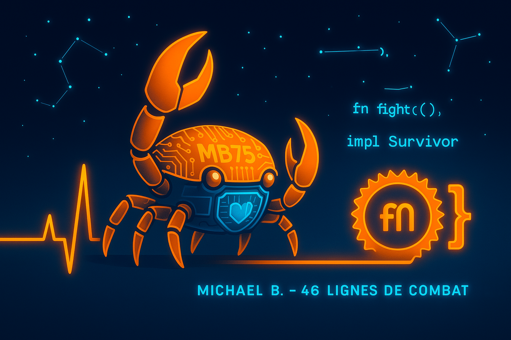

<p align="center">
  
</p>


## Hi there 👋

# 🦀 Michael Boutelet | Former Civil Servant → Rust Developer in Training

### 🚀 **About Me**
- 👨‍💻 **46-year-old career changer** mastering Rust to become employable by 2026
- 🏛 **20+ years as a civil servant** now building a new legacy in tech
- 🌱 **Currently improving**: Async Rust, LeetCode patterns, and technical English
- ⏳ **Life philosophy**: *"I code each day as if it's my last - because it might be."*

### 🛡 **My Journey**
- 🩺 **Living with incurable cancer**, transforming limitations into compile-time errors
- 🌿 **Self-taught through pain**: Using coding as therapy and natural healing
- 🔥 **Why Rust?** It values safety and performance - just like my new approach to life

### 🛠 **Skills in Progress**
| **Rust**              | **Algorithms**        | **Civil Service Superpowers** |
|-----------------------|-----------------------|------------------------------|
| Ownership/Borrowing   | 150+ LeetCode solved  | Unmatched perseverance        |
| Actix-Web/Tokio      | System design patterns| Precision in documentation    |
| Embedded Rust basics | Memory optimization   | Crisis management skills     |

### 🏗 **Featured Projects**
# 🦀 Michael Boutelet | Rust & Resilience

### 💻 **My Journey in Code**
```rust
// ♡ Mon combat en Rust ♡
struct Survivor {
    strength: u32,    
    rust_skills: u32, 
}

impl Survivor {
    fn new() -> Self {
        Survivor {
            strength: 100,
            rust_skills: 46,
        }
    }

    fn fight(&mut self) {
        self.rust_skills += 1; 
    }
}
